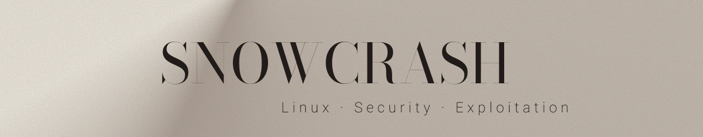

  

## 0 1 — P R O J E C T
SnowCrash is a series of CTF-style security challenges focused on Linux systems, binary exploitation, and privilege escalation.  
The goal of each level is to retrieve the flag by analyzing files, processes, and services, while learning security techniques.

## 0 2 — S K I L L S
- Linux filesystem exploration and file permissions analysis
- Basic binary analysis and understanding of stripped executables
- Use of debugging tools (GDB) and reverse engineering techniques
- Network basics, SSH, and port forwarding
- Privilege escalation and automated process analysis
- Documentation of technical solutions and methodology

## 0 3 — L E V E L S
- Level00 – Basic file enumeration and Caesar cipher decoding
- Level01 - Extracting a password hash and cracking it with John the Ripper
- Level02 - Telnet credential recovery via packet capture analysis
- Level03 - Privilege escalation via SUID binary and PATH hijacking
- Level04 – Command injection via SUID Perl web script
- Level05 - Exploiting scheduled script with arbitrary code execution
- Level06 - Privilege escalation via PHP code injection
- Level07 - Command injection via environment variable in SUID binary
- Level08 - Symlink bypass of filename-based access control in SUID binary
- Level09 - Reversing a positional shift algorithm in a SUID binary
- Level10 - TOCTOU race condition exploitation in SUID binary
- Level11 - Command injection in a local SUID Lua service
- Level12 - Command injection in SUID Perl CGI service
- Level13 - UID check bypass in SUID binary
- Level14 - Anti-debugging and UID check bypass in SUID getflag binary

Each write-up contains:
- A description of the vulnerability
- Steps to exploit it
- Screenshots / proofs of successful exploitation
- Remediation suggestions

## 0 4 — R E S O U R C E S
- Screenshots and outputs for each level are stored in the `images/` folder.

## 0 5 — S O U R C E
- This repository focuses on write-ups and documentation.
- No binaries or sensitive files are included, only proofs, notes, and scripts.
